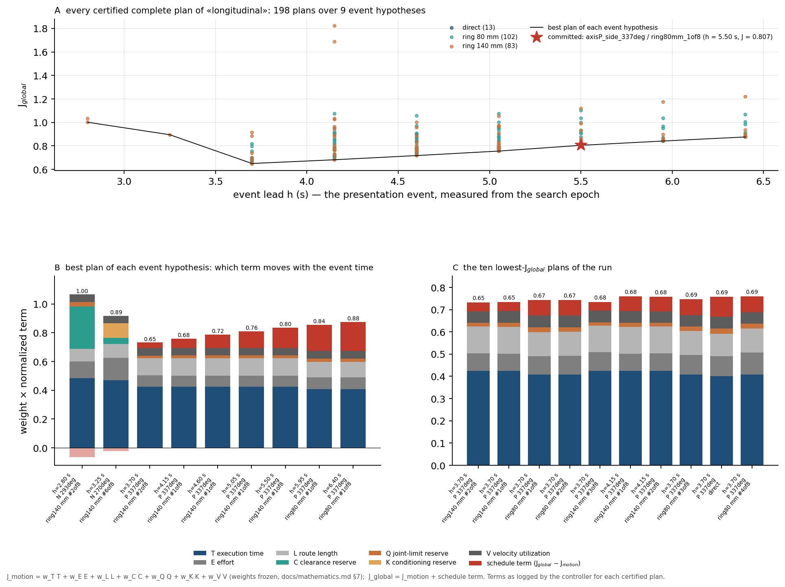
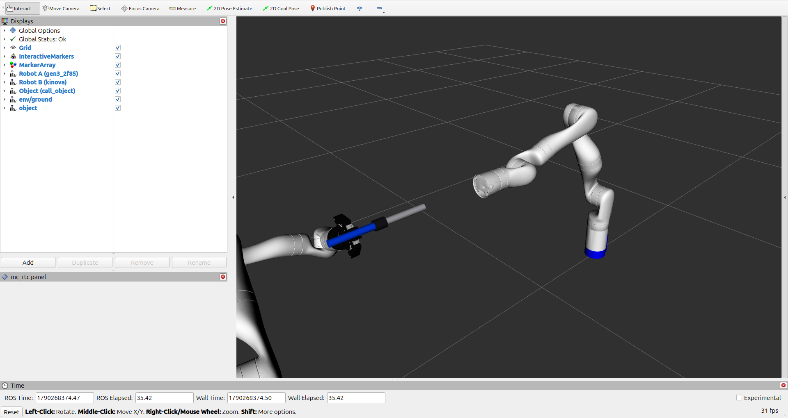

# TRIAD

**Finite complete-plan selection for predictive human-to-robot handover**

TRIAD is the receiver-side controller of a Kinova Gen3 arm with a Robotiq 2F-85
gripper, on mc_rtc. It predicts where the object will be, enumerates a bounded
bank of complete plans over event time, grasp and transit route, certifies each
plan through acquisition and retreat, commits to one, and executes it. A second
Gen3 can act as the giver: the handover runs robot-to-robot in simulation, and
the two physical arms of the laboratory were operated together (on video; no
complete hardware handover was validated).

What the method is, its three modes and what was measured: [ABOUT.md](ABOUT.md).
The paper: [`paper/triad_system_paper.pdf`](paper/triad_system_paper.pdf).

This page is the practical path: clone and build, watch one robot, watch two
robots, then hardware.

## 1. Clone everything and build

You need Linux with an [mc_rtc](https://jrl.cnrs.fr/mc_rtc/tutorials/introduction/installation-guide.html)
installation (tested with mc_rtc 2.14 on Ubuntu 24.04). Nothing is installed
into it: TRIAD runs from its own build tree.

```bash
# TRIAD and the two pinned robot-description packages
git clone https://github.com/harryjavadinia-creator/TRIAD-handover-controller.git
cd TRIAD-handover-controller
export TRIAD_DEPENDENCIES="$PWD/../TRIAD-dependencies"
git clone --depth 1 --branch 0.2.6 https://github.com/Kinovarobotics/ros2_kortex.git "$TRIAD_DEPENDENCIES/ros2_kortex"
git clone --depth 1 --branch 0.0.1 https://github.com/PickNikRobotics/ros2_robotiq_gripper.git "$TRIAD_DEPENDENCIES/ros2_robotiq_gripper"

# the Gen3 + 2F-85 robot module for mc_rtc (URDF and 26 meshes are hash-checked)
python3 scripts/setup_gen3_2f85_module.py \
  --upstream-urdf "$TRIAD_DEPENDENCIES/ros2_kortex/kortex_description/robots/gen3_2f85.urdf" \
  --kortex-share  "$TRIAD_DEPENDENCIES/ros2_kortex/kortex_description" \
  --robotiq-share "$TRIAD_DEPENDENCIES/ros2_robotiq_gripper/robotiq_description" \
  --output "$PWD/gen3_2f85_module"

# build against your mc_rtc (no install step)
export TRIAD_MC_RTC_PREFIX=/path/to/your/mc_rtc/install      # e.g. $HOME/mc_rtc_ws/install
env -u AMENT_PREFIX_PATH -u COLCON_PREFIX_PATH -u ROS_PACKAGE_PATH CMAKE_PREFIX_PATH="$TRIAD_MC_RTC_PREFIX" \
  cmake -S . -B build -G Ninja -DCMAKE_BUILD_TYPE=RelWithDebInfo -DCMAKE_DISABLE_FIND_PACKAGE_rclcpp=ON   # -G Ninja needs ninja-build; drop it to use make
cmake --build build -j"$(nproc)"
```

For the two-robot runs Robot B needs the `Kinova` robot module from
[mc_kinova](https://github.com/mathieu-celerier/mc_kinova), built and installed
into the same mc_rtc (it needs `xacro` and `kortex_description`). For watching,
RViz needs mc_rtc built with its ROS plugin; the standalone
[mc-rtc-magnum](https://github.com/mc-rtc/mc_rtc-magnum) viewer needs no ROS.

Every run below starts from these four variables, set once per terminal:

```bash
cd TRIAD-handover-controller
export PATH="$TRIAD_MC_RTC_PREFIX/bin:$PATH"
export MAIN_ROBOT_MODULE_PATH="$PWD/gen3_2f85_module"
export TRIAD_BUILD_DIR="$PWD/build"
export MC_RTC_INSTALL="$TRIAD_MC_RTC_PREFIX"
```

Do not run `cmake --install build`: mc_rtc's CMake macros would install into
the mc_rtc installation itself and overwrite any controller already there
([troubleshooting](docs/troubleshooting.md)).

## 2. See one robot

The object moves on a scripted trajectory; the arm observes it, plans, reaches,
closes on it and retreats with it. Four scenarios are recorded as evidence.

Terminal 1, the viewer (start it first; the runner stops the simulation as soon
as the handover ends):

```bash
source /opt/ros/jazzy/setup.bash                  # your ROS distribution
source /path/to/mc_rtc_ros_ws/install/setup.bash  # the mc_rtc_ros workspace (mc_rtc's ROS plugin)
rviz2 -d two_robot/display_two_robot.rviz
```

Terminal 2, the run (the four variables above, then):

```bash
export TRIAD_SYNC_RATIO=0.5          # half speed while a viewer is attached, see below
scripts/run_scenario.sh longitudinal  # object comes straight at the arm
scripts/run_scenario.sh near-ground   # low, from one side
scripts/run_scenario.sh lateral-low   # low, from the other side
scripts/run_scenario.sh diagonal      # forward and upward
```

You see the object arrive, the arm move to its standoff, wait for the object to
stop, close, and carry it back. Each run ends with

```text
HANDOVER_COMPLETED=true
RUNTIME_CHECKER_RESULT=PASS
SCENARIO_IDENTITY_RESULT=PASS
```

and leaves its log, override and checker output under `results/`. The log holds
the state sequence up to `Completed`, the size of the plan set and the committed
plan (`candidate=… route=… globalJ=…`). The committed plans of the reference
runs are listed in [docs/experiments.md](docs/experiments.md#reference-run-winners)
and their logs are in [`evidence/reference_runs/`](evidence/reference_runs/).
`TRIAD_RECEIVER_MODE=v2 scripts/run_scenario.sh <scenario>` runs the receding
mode instead; `TRIAD_MAX_WAIT` bounds the wall-clock wait (default 180 s).

**What a run leaves behind.** `results/<run>/` holds the text log, the scenario
override and the checker outputs; mc_rtc's binary log of the same run is in
`/tmp/mc-control-HandoverInterceptionController-<date>.bin` (convert it with
`mc_bin_utils convert --in <bin> --out <name> --format csv --entries t Executor_Main …`;
the two-robot runner copies its `.bin` into `two_robot/results/<run>/` instead).
The text log lists every certified plan with its seven objective terms, and

```bash
python3 tools/plot_plan_costs.py results/<run>/longitudinal.log
```

draws them: every plan against its event lead, the weighted terms of the best
plan of each event hypothesis, and the ten cheapest plans, with the committed
plan marked. The reference logs of the four scenarios are in
[`evidence/reference_runs/`](evidence/reference_runs/) and their figures in
[docs/results.md](docs/results.md#the-objective-of-every-certified-plan):



**Half speed while watching.** The planner's search runs on a background worker
in real time and a viewer lengthens it (`lateral-low`: 3.9 s in the reference
log, 5.0 s with RViz attached, both in
[`evidence/reference_runs/`](evidence/reference_runs/)). The simulated object
reaches its 0.40 m travel cap about 4 s after the search epoch, so the longer
search fails the pre-commit consistency check. `TRIAD_SYNC_RATIO=0.5` runs the
simulation at half speed: the run completes with the same three result lines,
but the committed plan can differ from the reference, because timing admission
is evaluated at the simulated time the search returns. Leave it unset, without a
viewer, to reproduce the reference winners.

## 3. See two robots

Robot B (a second Gen3, module `Kinova`, base at 1.35 m facing Robot A) carries
the object toward Robot A along a fixed trajectory and stops; Robot A observes
the carried object, evaluates its complete grasp × route bank once at Robot B's
endpoint, commits, closes on the object in Robot B's tool, takes the load and
retreats with it.

Terminal 1 as above. Terminal 2, the four variables, then:

```bash
export TRIAD_SYNC_RATIO=0.5
bash two_robot/run_two_robot_sim.sh 80                                       # Robot B straight toward A
TRIAD_GIVER_SCENARIO=diagonal_xz    bash two_robot/run_two_robot_sim.sh 80   # from low, rising toward A
TRIAD_GIVER_SCENARIO=static_nominal bash two_robot/run_two_robot_sim.sh 80   # Robot B holds still
TRIAD_INIT_STATE=HandoverInterceptionController_RobotBScenarioPreview bash two_robot/run_two_robot_sim.sh 30   # Robot B alone, A holds
```

The terminal prints Robot B's phases (Prepositioning → StartSettling → Ready →
Executing → TerminalSettling → Holding), Robot A's states, and ends with
`RESULT: COMPLETED` (the Robot B-alone preview ends with
`RESULT: RobotBScenarioPreview HELD`); the log, the override and the binary log
land under `two_robot/results/<run>/`, and `two_robot/tools/extract_timeline.py`
turns the binary log into the 20 ms timeline. This is the view during the
default scenario:



The recorded reference run is in
[`two_robot/results/sim_2026-09-24/`](two_robot/results/sim_2026-09-24/TIMELINE.md);
its timeline carries the object pose Robot A plans with and the pose Robot B
carries, which differ by at most 0.5 mm over the run.
Details of the giver module: [`two_robot/README.md`](two_robot/README.md).

## 4. Hardware

The same controller drives the physical arms through
[mc_kortex](two_robot/mc_kortex_patch/), mc_rtc's Kortex interface, instead of
the simulation ticker. Robot A is the Gen3 with the Robotiq gripper at
192.168.1.10, Robot B the Gen3 at 192.168.1.11, the laptop at 192.168.1.12 (edit
these in the profile if your network differs). Physical two-robot operation and
interaction are on video in [`two_robot/media/`](two_robot/media/); nine logged
runs entered the capture state on the physical arms and stopped at the closure
check against the virtual object model, none reached the retreat
([`two_robot/evidence/hardware_runs_2026-07-18/`](two_robot/evidence/hardware_runs_2026-07-18/README.md),
[docs/real_robot.md](docs/real_robot.md)).

Prerequisites: mc_kortex built with the three patched files in
`two_robot/mc_kortex_patch/` (per-robot joint maps for two arms), the `Kinova`
module for Robot B, and the gripper commissioning values of your gripper
(`two_robot/HandoverInterceptionController.hardware_receiver.yaml` carries the
July 2026 ones).

```bash
# 1. write ~/.config/mc_rtc/mc_rtc.yaml and the controller override from the repository files
#    (existing files are backed up); then put your Kortex credentials into mc_rtc.yaml
bash two_robot/prepare_hardware_config.sh

# 2. both arms reachable, distinct (needs nc and sudo; IFACE=<nic> LAPTOP_IP=… override the laboratory defaults)
bash two_robot/check_dual_network.sh

# 3. connect, read state, initialise, disconnect: no motion
bash two_robot/run_dual_init_only.sh

# 4. Robot A's gripper alone, arm frozen (non-contact smoke test; a switch of the Initial state)
python3 two_robot/tools/set_override_key.py configs.HandoverInterceptionController_Initial.hardwareGripperCommissioning.enabled true
mc_kortex
python3 two_robot/tools/set_override_key.py configs.HandoverInterceptionController_Initial.hardwareGripperCommissioning.enabled false

# 5. Robot B alone presents, Robot A holds
python3 two_robot/tools/set_override_key.py init HandoverInterceptionController_RobotBScenarioPreview
python3 two_robot/tools/set_override_key.py dualHandover.motionEnabled true
mc_kortex

# 6. the handover (disable_and_stop.sh switches Robot B's motion off after every run, so switch it on again)
python3 two_robot/tools/set_override_key.py init HandoverInterceptionController_Initial
python3 two_robot/tools/set_override_key.py dualHandover.motionEnabled true
mc_kortex

# after every run
bash two_robot/disable_and_stop.sh
```

`prepare_hardware_config.sh --single` writes the same configuration with Robot B
removed, for the gripper smoke test on Robot A alone. A handover from a human
hand on hardware additionally needs an object-pose source (perception) that this
repository does not provide; see [docs/real_robot.md](docs/real_robot.md) §3.
Emergency stop, workspace limits, tool and object calibration are yours to
establish before any motion; the receiver's force path (`transfer.source`)
stayed on the virtual sensor in every laboratory run.

## Where the rest is

| | |
| --- | --- |
| Method, modes, measured results, scope | [ABOUT.md](ABOUT.md) |
| Equations and decision rule | [docs/mathematics.md](docs/mathematics.md) |
| Results, experiments, evidence | [docs/results.md](docs/results.md), [docs/experiments.md](docs/experiments.md), [evidence/README.md](evidence/README.md) |
| Detailed setup, viewer, troubleshooting | [docs/quickstart.md](docs/quickstart.md), [docs/troubleshooting.md](docs/troubleshooting.md) |
| Reproducibility and provenance | [docs/reproducibility.md](docs/reproducibility.md), [docs/provenance.md](docs/provenance.md) |

Cite the repository title together with the commit or tag used for the reported
results.
