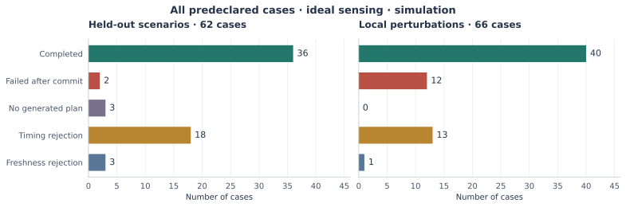

# TRIAD

**Joint Event-Time, Grasp and Route Selection for Predictive Human-to-Robot Handover**

TRIAD is a research controller for a Kinova Gen3 arm with a Robotiq 2F-85
gripper. It predicts future object-presentation events, compares complete
event–grasp–route plans, and executes one admissible plan through acquisition
and retreat. It is implemented in C++ using mc_rtc.

**Validation scope: simulation.** This repository provides the asynchronous
controller, mathematical method, scenario commands, and archived experimental
evidence. There is no validated end-to-end physical human-to-robot handover
campaign.

## Start here

| To… | Read |
| --- | --- |
| Build the controller and watch a simulation | [Quick start](docs/quickstart.md) |
| Understand the equations and decision rule | [Mathematical formulation](docs/mathematics.md) |
| Follow the algorithm and execution stages | [Architecture and pseudocode](docs/architecture.md) |
| See the experimental results and figures | [Results](docs/results.md) |
| Position the contribution in the literature | [Related work](docs/related_work.md) |
| Check data, source versions, and validation | [Reproducibility](docs/reproducibility.md) |

## Method

The decision is a complete plan $\xi=(\tau,g,r)$: **when** to receive the
object, **which grasp** to use, and **which transit route** to follow.

For the reported moving-object bank, **14 × 32 × 17 = 7616** is the upper
number of combinations before pruning. Each retained alternative is previewed
through the modeled handover phases and ranked only after hard feasibility
checks pass. At result receipt, the controller reapplies timing admission:

```math
\xi^*\in
\arg\min_{\xi\in\mathcal F_{\mathrm{timing}}(s_0,t_{\mathrm{sel}})}
J_{\mathrm{global}}(\xi;s_0).
```

Selection is exhaustive over this generated finite set, with a documented
numerical tie convention. A final prediction-freshness check precedes the
one-time commitment. TRIAD then generates and governs task-space references;
the mc_rtc task/QP layer realizes those references at the joint level.

The seven objective weights are fixed engineering preferences;
**no weight-sensitivity result is reported**. The [full formulation](docs/mathematics.md)
covers prediction, local IK, objective terms, timing, ties, and freshness.

## Results at a glance



| Campaign | Completed | Rejected before commitment | Failed after commitment |
| --- | ---: | ---: | ---: |
| Held-out scenarios, ideal sensing | 36 / 62 | 24 / 62 | 2 / 62 |
| Local perturbations, ideal sensing | 40 / 66 | 14 / 66 | 12 / 66 |

Held-out completion given commitment is **36/38 (94.7%)**; overall completion
is **36/62 (58.1%)**. These are empirical outcomes, **not feasible-space coverage**.
The full perturbation set is the primary robustness result.

The corrected latency study and asynchronous control-loop measurements are
shown in [Results](docs/results.md), alongside their conditions and limitations.
Figures come from the included records; each campaign retains its own
[source attribution](docs/provenance.md).

## Clone and run

```bash
git clone --branch publication/supervisor-release https://github.com/harryjavadinia-creator/TRIAD-handover-controller.git
cd TRIAD-handover-controller
```

Follow [Quick start](docs/quickstart.md) to prepare mc_rtc, reconstruct the
robot module, build TRIAD, and open the viewer. Once configured, run:

```bash
scripts/run_scenario.sh longitudinal
```

The other scenarios are `near-ground`, `lateral-low`, and `diagonal`.
The [simulation guide](docs/simulation.md) gives their inputs, completion
markers, and historical reference outputs.

To verify the published records without installing a simulator:

```bash
python3 tools/check_evidence_manifest.py
```

## Scope and limitations

The method uses deterministic prediction, a finite engineering discretization,
local numerical IK, and sampled object/ground proxy checks. No bank-resolution
convergence study, continuous collision proof, arbitrary-clutter perception,
human-body model, comprehensive self-collision checking, or post-commit global
replanning is established.

Ordinary worker-result polling is nonblocking; FSM teardown can reach worker
cancellation and `join()`. Residual live fingertip-frame reads affect aperture
checks. The measured timing is not WCET, and full copied-state purity or race
freedom is not established. See [Architecture](docs/architecture.md),
[Performance](docs/performance.md), and [Hardware status](docs/real_robot.md).

## Repository contents

| Directory | Contents |
| --- | --- |
| `src/` | Controller, finite selectors, and execution states |
| `etc/`, `configs/` | Controller and simulation configuration |
| `call_object_description/` | Handover object model |
| `scripts/`, `tools/` | Reproduction, verification, and figure generation |
| `docs/` | Method, setup, results, and technical appendices |
| `evidence/` | Compact experimental records and integrity checks |

TRIAD is the method name; `HandoverInterceptionController`, `call_handover`,
and `call_object` are the implementation identifiers used by the build and logs.

## Citation

Cite the repository title and the release or commit used. Publication citation
metadata will be added when a paper is finalized.
