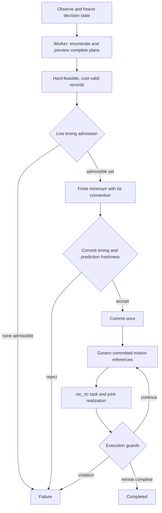

# Architecture

## Pipeline



TRIAD does more than choose **what** and **when**. It selects the event time,
grasp orientation and transit route, then constructs the committed task-space
reference along that route and applies the controller's live execution-side
reference governor and fail-closed safety logic. The downstream mc_rtc task/QP
layer realizes those per-cycle task-space, posture and gripper references at the
robot/joint level. The QP does not choose the event time, grasp, route or
high-level TRIAD objective.

The interface is narrow and worth stating exactly. Per control cycle TRIAD
supplies one `TransformTask` target pose, a body-frame reference velocity, a
zero reference acceleration, an arm-posture target and a six-joint gripper
target. It also configures one kinematics constraint, **no collision constraint
and no contacts**. No event time, grasp, route or objective value crosses into
the QP as a decision variable. Joint limits are therefore enforced twice and
independently — constructively inside TRIAD's own differential-IK step scaling,
and again by the QP — whereas collision safety is enforced **once, by TRIAD
alone**, through the planner/runtime checks implemented in this controller.

mc_rtc's internal QP formulation is not reproduced in this repository and no QP
equation is claimed from it.

## One frozen decision state, one final timing gate

Candidate generation and copied-state feasibility evaluation use one frozen
decision state `s0` and one frozen bounded prediction schedule. This makes
geometric and cost comparisons across event hypotheses refer to a common
search epoch.

Timing is different: after the full bounded schedule has been inspected,
`FiniteEventPlanSelector` reapplies the timing-admission rule using the
controller time `now` at final selection. A complete plan must therefore pass:

1. copied-state hard physical feasibility;
2. finite/valid objective construction; and
3. the final selection-time timing gate.

See [`mathematics.md`](mathematics.md) for the corresponding sets and
[`timing_frontiers.md`](timing_frontiers.md) for the hardware-facing replay.

## Algorithm

```text
On observation completion:
    Freeze the decision state and bounded event schedule.
    Submit one worker generation.

In the worker:
    For every generated event:
        Predict the presentation pose.
        For each grasp and its generated routes:
            Preview reach, approach, dwell, closure, and attached retreat.
            Retain complete records that pass the modeled hard checks.
            Construct the motion objective and common-epoch time contribution.
    Publish the result with its generation identity.

On result receipt in the control thread:
    Verify generation and result consistency.
    Exclude invalid-cost records; apply current timing admission.
    If no admissible record remains: enter Failure.
    Select the finite minimum using the numerical tie convention.
    Recheck winner timing and refreshed prediction at commitment.
    If either check fails: enter Failure.
    Commit the selected event, grasp, and route once.

During execution:
    Generate and govern the committed task-space reference.
    Send task, posture, and gripper targets to the mc_rtc layer.
    Enforce phase-specific runtime guards.
    Enter Completed after retreat, or Failure on a guard violation.
```

This is structural pseudocode. Equations, tie ordering, and copied-state
qualifications are given in [Mathematics](mathematics.md) and below.

## Implementation map

- `src/HandoverInterceptionController.{h,cpp}` contains candidate generation,
  copied-state preview, feasibility tests, objective construction and commit
  support.
- `src/FinitePlanSelector.h` is the within-event finite selector. It is also
  used by the event-time refinement path.
- `src/FiniteEventPlanSelector.h` is the cross-event selector used by
  `global_time_plan`; it reapplies final timing admission and selects the
  finite global minimum.
- `src/states/HandoverInterceptionController_SolveInterception.cpp` builds the
  bounded event schedule, evaluates every configured event, pools complete
  alternatives and performs the one-time global selection.
- `src/states/` contains the compiled mc_rtc FSM states. The active state list
  is defined in `src/states/CMakeLists.txt`; transitions and configuration are
  in `etc/HandoverInterceptionController.in.yaml`.

TRIAD is the public method name. `call_handover` and
`HandoverInterceptionController` are retained implementation identifiers from
the CALL project lineage.

## Active FSM

| State | Role |
| --- | --- |
| Initial | Prepare the arm and gripper |
| ObserveObject | Estimate object motion and classify the observation |
| SolveInterception | Freeze, enumerate, select, and admit a plan |
| ExecuteCommittedReach | Follow the selected transit reference |
| PresentationHold | Maintain the presentation relationship |
| MovePregrasp | Enter the receiver capture corridor |
| CaptureTransfer | Close, confirm bilateral contact, and transfer |
| Retreat | Execute the checked attached-object retreat |
| Completed | Record successful completion |

Any rejected or unsafe execution path enters `Failure`. `CaptureTransfer`
owns closure, bilateral confirmation and load transfer continuously in the
compiled release.

## Configuration

`etc/HandoverInterceptionController.in.yaml` is a CMake `configure_file`
template. Build-time placeholders are replaced with the actual mc_rtc runtime
install locations. Scenario-specific object pose/velocity values are applied
through a temporary per-controller override by `scripts/run_scenario.sh`, so
the tracked template is not edited during reproduction.

## Runtime verification

`tools/check_global_time_plan_log.py` independently inspects a completed run.
It checks schedule completeness, reconciles pooled and excluded alternatives,
reconstructs the frozen seven-term binding objective from logged terms, and,
when timing-diagnostic records are present, independently verifies the exact
argmin over the cost-valid and final-timing-admissible set.

Scenario identity is checked separately by
`tools/verify_scenario_identity.py`. This separation prevents a scientifically
valid log from being mistaken for evidence from the wrong scenario.

## Asynchronous planning

The complete finite search runs on one background worker. The control thread
freezes a snapshot, submits one planning generation and returns; on later cycles
ordinary result polling is an atomic-state check and is nonblocking. When a
result appears it applies current timing admission, takes the exact finite
argmin and commits once, or fails closed.

The handoff is a single result buffer with release/acquire publication. There is
never more than one job in flight; the worker writes the result and its
generation before the release store, and the control thread reads them only
after the paired acquire load. Generation identity is carried on the result and
checked on arrival, an exception inside the worker is caught at the thread
boundary, and `detach()` appears nowhere.

Worker lifecycle is more nuanced than ordinary polling. The planning state's
`teardown()` can call `shutdownPlannerWorker()`, which cancels and joins the
worker; the same shutdown path is also used from `reset()` and the destructor.
Therefore an absolute statement that no `join()` is reachable from the
controller call path is not made here. No bounded join latency, WCET, hard-real-
time guarantee or formal schedulability result is established.

The worker pins the planning-time admission reference used during frozen-bank
enumeration to the frozen search epoch, so a hypothesis is not skipped merely
because worker computation consumed wall time. Current selector-time timing
admission is still applied once when the result is received. See
[`corrections_of_record.md`](corrections_of_record.md) for the precise historical
comparison.

## Copied-state scope

Candidate certification is built primarily from a copied `MultiBodyConfig`
taken once at the search epoch, together with a planner-owned robot model and a
planner-owned object/handle world. The repository ships a static guard,
`tools/check_planner_core_purity.py`, with mutation tests for several classes of
live-state access.

The defensible property is narrower than full copied-state purity:

> Most candidate kinematics use the frozen copied state. Residual live
> fingertip-frame reads determine the gripper aperture used by corridor checks,
> and joint position/velocity limits are obtained through live model accessors.
> The static guard does not cover those paths.

The limit values are properties of the robot model, while the aperture path is
computed from live frame positions even though planning interlocks command the
gripper open. Those interlocks and stable repeated plan hashes are useful
engineering checks, but they do not establish full copied-state purity or race
freedom. The residual live-read issues remain documented and unfixed in the
frozen scientific source.

See [`corrections_of_record.md`](corrections_of_record.md) for the correction of
record and [`provenance.md`](provenance.md) for the frozen-source policy.
