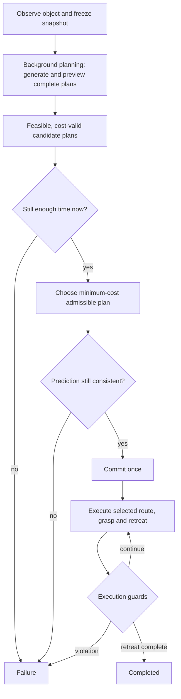

# Architecture

## TRIAD at a glance

TRIAD makes one complete handover decision:

\[
\xi=(\tau,g,r)
\]

where `tau` is the future handover event time, `g` is the grasp, and `r` is the transit route.

The controller observes the object, freezes one decision snapshot, evaluates a finite bank of complete event-grasp-route plans in the background, and then commits one admissible plan.



The scientific sequence is therefore:

```text
OBSERVE
  -> FREEZE SNAPSHOT
  -> GENERATE (event time, grasp, route)
  -> CHECK HARD FEASIBILITY
  -> COMPUTE COST
  -> CHECK CURRENT TIMING
  -> SELECT BEST ADMISSIBLE PLAN
  -> CHECK PREDICTION CONSISTENCY
  -> COMMIT ONCE
  -> EXECUTE
```

## What "background planning" means

The finite TRIAD search can be computationally expensive because many complete plans must be predicted and previewed. Instead of performing that whole search directly inside the normal controller cycle, TRIAD sends the frozen decision snapshot to one background worker.

The worker runs the same TRIAD calculation:

```text
frozen snapshot
    -> event hypotheses
    -> grasp hypotheses
    -> route hypotheses
    -> complete-plan preview
    -> hard feasibility
    -> objective values
    -> candidate records
```

While this calculation is running, the main controller continues its normal control cycle. When the worker finishes, its candidate records are returned to the controller.

This is **not a second planner, a second objective, or a different scientific method**. It is the same TRIAD search executed on a separate computation thread so the main controller does not have to wait for the full search.

Because some wall time passes while the worker is calculating, the result is checked again before commitment. The controller asks two separate questions:

1. **Timing:** is there still enough time to execute this plan?
2. **Prediction consistency:** is the predicted future object pose still sufficiently consistent with the current observation?

If either check fails, the controller fails closed instead of committing a stale plan.

## TRIAD and mc_rtc have different roles

TRIAD makes the high-level handover decision. It chooses the event time, grasp and route, then generates the committed task-space reference.

The downstream mc_rtc task/QP layer realizes those references at the robot/joint level. The QP does **not** choose `tau`, `g`, `r`, or the TRIAD objective.

Per control cycle, TRIAD supplies the task-space target and the arm/gripper references needed for execution. Joint limits are handled both inside TRIAD's numerical preview and by the downstream robot-control layer. Collision and handover-specific safety checks used by this controller are implemented on the TRIAD side rather than as TRIAD decision variables inside the QP.

## Algorithm

```text
1. Observe the moving object.
2. Freeze the decision state and bounded prediction schedule.
3. Send that frozen snapshot to the background worker.

4. In the worker:
      for every candidate event time:
          predict the future object pose
          for every grasp:
              for every generated route:
                  preview the complete handover
                  reject hard-infeasible plans
                  compute the objective for surviving plans
      return the surviving candidate records

5. When the result returns:
      remove invalid records
      apply current timing admission
      if none remain -> Failure
      choose the finite minimum-cost plan
      recheck winner timing and prediction consistency
      if either fails -> Failure

6. Commit the selected (event time, grasp, route) once.

7. Execute:
      selected reach/route
      presentation and pregrasp
      capture and transfer
      attached-object retreat

8. Runtime guard violation -> Failure
   Retreat completed -> Completed
```

The exact feasibility sets, objective terms, timing equations and numerical tie rule are documented in [Mathematics](mathematics.md).

## Implementation map

- `src/HandoverInterceptionController.{h,cpp}` — prediction, candidate generation, complete-plan preview, feasibility tests, objective construction and commit support.
- `src/FinitePlanSelector.h` — finite selection within one event hypothesis.
- `src/FiniteEventPlanSelector.h` — final selection across event hypotheses, including current timing admission.
- `src/states/HandoverInterceptionController_SolveInterception.cpp` — freezes the planning problem, launches/receives background planning and performs final admission/selection.
- `src/states/` — execution FSM states.
- `etc/HandoverInterceptionController.in.yaml` — controller and scenario configuration template.

TRIAD is the public method name. `call_handover` and `HandoverInterceptionController` are implementation identifiers retained from the CALL project lineage.

## Active FSM

| State | Role |
| --- | --- |
| Initial | Prepare the arm and gripper |
| ObserveObject | Estimate object motion and classify the observation |
| SolveInterception | Freeze the problem, obtain the plan set, select and admit one plan |
| ExecuteCommittedReach | Follow the selected transit reference |
| PresentationHold | Maintain the presentation relationship |
| MovePregrasp | Enter the receiver capture corridor |
| CaptureTransfer | Close, confirm bilateral contact and transfer |
| Retreat | Execute the checked attached-object retreat |
| Completed | Record successful completion |

Any rejected or unsafe execution path enters `Failure`.

## Runtime verification

`tools/check_global_time_plan_log.py` independently inspects completed simulation logs. It checks the generated schedule, candidate records, objective reconstruction and final finite selection when the corresponding diagnostics are present.

`tools/verify_scenario_identity.py` separately checks that a run corresponds to the intended scenario.

## Technical scope

The background worker uses one frozen planning snapshot for most candidate calculations. Ordinary worker-result polling does not block the normal controller cycle. Shutdown/reset paths may still cancel and join the worker, so the repository does **not** claim a WCET bound, hard-real-time guarantee or formal schedulability proof.

Most candidate kinematics use the frozen copied robot state. A small number of implementation paths still read live fingertip-frame information for gripper aperture and live robot-model accessors for joint limits. For that reason, the repository does **not** claim complete copied-state purity or formal race freedom.

These qualifications do not change the high-level TRIAD decision process above; they define the current implementation scope. Detailed historical corrections and provenance are kept in [Corrections of record](corrections_of_record.md) and [Provenance](provenance.md).
