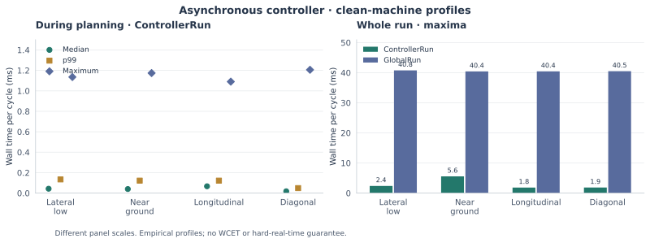

# Simulation results

The published evidence is grouped here by scientific question. All end-to-end
outcomes are from simulation. Campaign source states and record-level
qualifications are retained in [Provenance](provenance.md).

## Does the method complete held-out handovers?


| Outcome | Held-out scenarios | Local perturbations |
| --- | ---: | ---: |
| Completed | 36 | 40 |
| Failed after commitment | 2 | 12 |
| No physically feasible generated plan | 3 | 0 |
| No timing-admissible plan at result receipt | 18 | 13 |
| Prediction freshness rejected commitment | 3 | 1 |
| **Total** | **62** | **66** |

Both campaigns used ideal sensing and predeclared inputs. Overall held-out
completion was **36/62 (58.1%)**; **38/62** committed, of which **36/38 (94.7%)**
completed. Overall perturbation completion was **40/66 (60.6%)**; **52/66**
committed, of which **40/52 (76.9%)** completed.

The complete 66-case set is the primary robustness result. The H002 anchor
family contains **3 complete and 8 fail** outcomes among 11 perturbations.
The H002-excluded analysis is a **secondary, post-hoc diagnostic**.

These fractions are not feasible-space coverage. A rejected generated bank
does not prove that no physical handover exists. The 18 held-out timing
rejections remain unresolved against a complete physical feasibility oracle.
The retained offline reference tests relaxed endpoint witnesses, not complete
grasp/path/closure/retreat solutions.

Data: [held-out outcomes](../evidence/generalization/outcomes.json),
[perturbation outcomes](../evidence/robustness/outcomes.json),
[input protocols and interpretation](../evidence/README.md).

## What does delay compensation change?


The plot uses recorded straight-motion estimate errors, in millimetres.
Missing values are left unplotted. Low position error alone is not a sufficient
condition for completing the full handover.

| Configured delay | Compensated | Uncompensated |
| --- | --- | --- |
| 0.00 s | Shared ideal reference: completed | Shared ideal reference: completed |
| 0.10 s | Completed | Completed |
| 0.22 s | Completed | Completed |
| 0.30 s | Completed | Failed after commitment |
| 0.40 s | Failed after commitment | Failed after commitment |
| 0.50 s | Failed after commitment | Failed after commitment |
| 0.60 s | Freshness rejection before commitment | Ambiguous observation; no finite search |

The reduced sweep has one record per nonzero-delay condition. The archived
report additionally records four repeats per mode at 0.30 s: four compensated
completions and four uncompensated failures after commitment. Those repeats
are not four plotted estimates or a confidence interval.

At uncompensated 0.60 s, classification is `AMBIGUOUS`: displacement is
0.0241 m, below the 0.0250 m moving threshold, while speed is 0.0760 m/s,
above the 0.0100 m/s static threshold. The archived fallback outcome code
does not establish physical infeasibility. See the
[interpretation note](corrections_of_record.md).

Data: [corrected sweep records](../evidence/latency/sweep_rows.json),
[archived latency report](../evidence/latency/FINAL_LATENCY_REPORT.md).

## How much controller time is used while planning?



The left panel shows reported quantiles and maxima of **in-planning
ControllerRun** samples. The right panel gives whole-run ControllerRun and
GlobalRun maxima from the same summaries. The panels have different vertical
scales and measurement scopes.

All four published in-planning ControllerRun maxima are below 2 ms; each
profile includes one sample above 1 ms. Whole-run maxima are higher.
These are empirical measurements on one machine, not WCET, a 1 kHz deadline
guarantee, or a schedulability proof. Planner completion and result receipt
remain subject to live timing admission.

Data: clean-machine summaries for
[lateral-low](../evidence/async/lateral-low/perf_analysis_clean_machine.txt),
[near-ground](../evidence/async/near-ground/perf_analysis_clean_machine.txt),
[longitudinal](../evidence/async/longitudinal/perf_analysis_clean_machine.txt),
and [diagonal](../evidence/async/diagonal/perf_analysis_clean_machine.txt).
The [performance appendix](performance.md) retains serial measurements,
timing-frontier analysis, and plan-set comparison qualifications.

## Canonical scenarios and earlier latency study

The four canonical moving-object scenarios provide reference event, grasp,
route, and cost values in [Simulation](simulation.md). Their original
campaign and exact-serial runtime revalidation retain their own attribution.
The earlier five-scenario latency matrix is documented in
[Experiments](experiments.md). It is separate from the corrected sweep above.

## Regenerate these figures

The figures are derived from already-published records. No controller run or
new experiment is performed:

```bash
python3 -m venv .venv-figures
.venv-figures/bin/python -m pip install -r tools/figure_requirements.txt
.venv-figures/bin/python tools/plot_results.py
```

The script reads the JSON records and four timing summaries and writes SVGs
under `docs/figures/`. The archived inputs are left unchanged.
