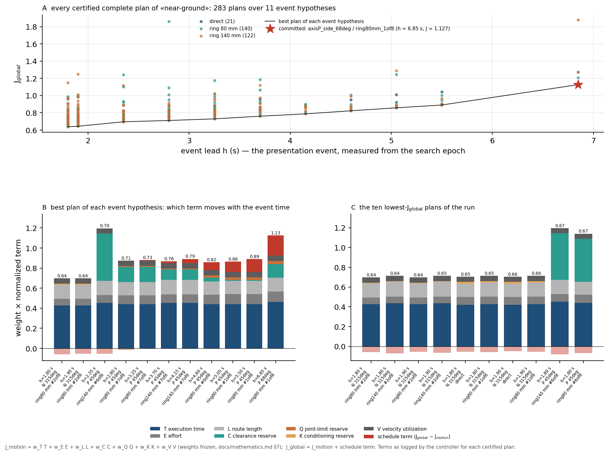
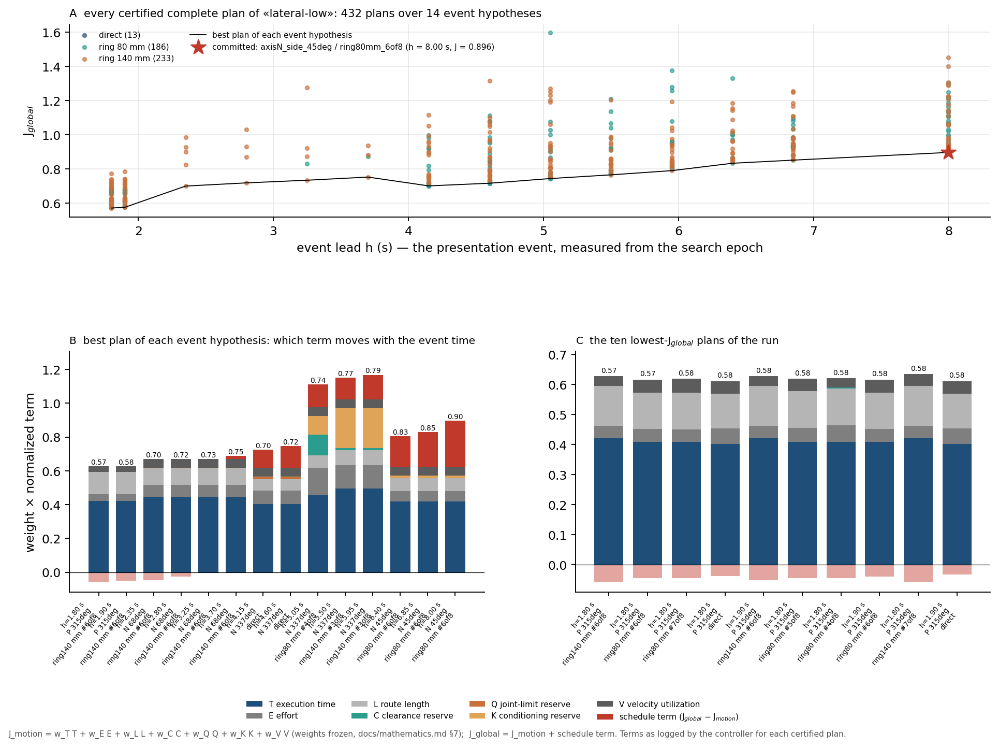
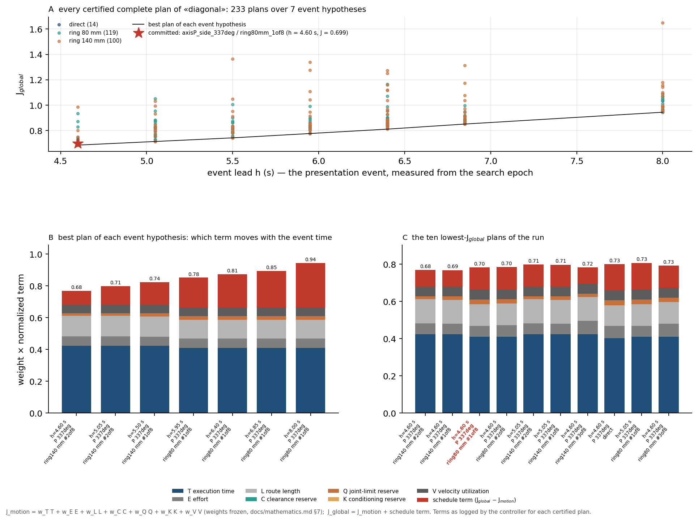

# Simulation results

All end-to-end outcomes described here are from simulation. The results below
cover the canonical finite-plan scenarios and the corrected perception-latency
ablation.

## Canonical finite-plan scenarios

The four canonical moving-object scenarios provide reference event, grasp,
route and global-cost values for the finite TRIAD selector. They are documented
in [Simulation](simulation.md) and retain their source attribution in
[Provenance](provenance.md).

Together they exercise the complete TRIAD chain:

```text
predict event
→ generate event/grasp/route candidates
→ reject hard-infeasible plans
→ rank valid plans
→ apply final timing admission
→ commit once
→ execute capture and retreat
```

## The objective of every certified plan

`tools/plot_plan_costs.py <scenario.log>` reads the `[GlobalPlanCost]` and
`[CompletePlanCost]` lines of a run and draws, for that run, every certified
complete plan against its event lead (panel A), the seven weighted terms of the
best plan of each event hypothesis (panel B: which term moves when the event
time moves) and the ten lowest-cost plans (panel C). The committed plan is the
timing-admissible argmin at the moment the search returns, which is why it is
not always the lowest point of panel A. The figures below come from the
reference runs in [`evidence/reference_runs/`](../evidence/reference_runs/).






Read across the four: the execution-time term `T` is the largest contribution
of every plan and barely changes between plans of one hypothesis; the reserve
terms (`C`, `Q`, `K`) are what separates plans at the same event time; and the
schedule term grows with the event lead, so later events cost more unless the
motion terms drop.

## What does delay compensation change?


The plot uses recorded straight-motion estimate errors, in millimetres.
Missing values are left unplotted. Low position error alone is not a sufficient
condition for completing the full handover.

| Configured delay | Compensated | Uncompensated |
| --- | --- | --- |
| 0.00 s | Shared ideal reference: completed | Shared ideal reference: completed |
| 0.10 s | Completed | Completed |
| 0.22 s | Completed | Completed |
| 0.30 s | Completed | Failed after commitment |
| 0.40 s | Failed after commitment | Failed after commitment |
| 0.50 s | Failed after commitment | Failed after commitment |
| 0.60 s | Prediction-consistency rejection before commitment | Ambiguous observation; no finite search |

The latency report additionally records four repeats per mode at 0.30 s:
four compensated completions and four uncompensated failures after commitment.

At uncompensated 0.60 s, classification is `AMBIGUOUS`: displacement is
0.0241 m, below the 0.0250 m moving threshold, while estimated linear speed is
0.0760 m/s, above the 0.0100 m/s static threshold. See the
[technical qualification](corrections_of_record.md).

Data: [corrected sweep records](../evidence/latency/sweep_rows.json) and
[latency report](../evidence/latency/FINAL_LATENCY_REPORT.md).

## Historical latency matrix

An earlier five-scenario latency matrix is preserved under tag
`dataset-a-baseline` and attributed in [Provenance](provenance.md). Its numbers
are not merged with the corrected sweep above.

## Regenerate the figure

The latency figure is derived from included records. No controller run or new
experiment is performed:

```bash
python3 -m venv .venv-figures
.venv-figures/bin/python -m pip install -r tools/figure_requirements.txt
.venv-figures/bin/python tools/plot_results.py
```

The script writes `latency.svg` under `docs/figures/`.
