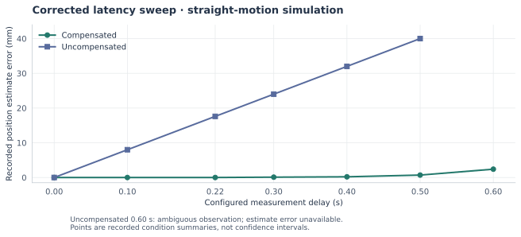

# Simulation results

The current release keeps only the evidence directly used for the present
TRIAD controller/method discussion. All end-to-end outcomes described here are
from simulation.

## Canonical finite-plan scenarios

The four canonical moving-object scenarios provide reference event, grasp,
route and global-cost values for the finite TRIAD selector. They are documented
in [Simulation](simulation.md) and retain their historical source attribution in
[Provenance](provenance.md).

These scenarios are the clearest end-to-end demonstration of the complete
TRIAD chain:

```text
predict event
→ generate event/grasp/route candidates
→ reject hard-infeasible plans
→ rank valid plans
→ apply final timing admission
→ commit once
→ execute capture and retreat
```

## What does delay compensation change?



The plot uses recorded straight-motion estimate errors, in millimetres.
Missing values are left unplotted. Low position error alone is not a sufficient
condition for completing the full handover.

| Configured delay | Compensated | Uncompensated |
| --- | --- | --- |
| 0.00 s | Shared ideal reference: completed | Shared ideal reference: completed |
| 0.10 s | Completed | Completed |
| 0.22 s | Completed | Completed |
| 0.30 s | Completed | Failed after commitment |
| 0.40 s | Failed after commitment | Failed after commitment |
| 0.50 s | Failed after commitment | Failed after commitment |
| 0.60 s | Prediction-consistency rejection before commitment | Ambiguous observation; no finite search |

The archived report additionally records four repeats per mode at 0.30 s:
four compensated completions and four uncompensated failures after commitment.

At uncompensated 0.60 s, classification is `AMBIGUOUS`: displacement is
0.0241 m, below the 0.0250 m moving threshold, while estimated linear speed is
0.0760 m/s, above the 0.0100 m/s static threshold. See the
[interpretation note](corrections_of_record.md).

Data: [corrected sweep records](../evidence/latency/sweep_rows.json) and
[archived latency report](../evidence/latency/FINAL_LATENCY_REPORT.md).

## Earlier latency matrix

The earlier five-scenario latency matrix is documented separately in
[Experiments](experiments.md). It is historical evidence and should not be
merged numerically with the corrected sweep above.

## Regenerate the figure

The latency figure is derived from already-published records. No controller run
or new experiment is performed:

```bash
python3 -m venv .venv-figures
.venv-figures/bin/python -m pip install -r tools/figure_requirements.txt
.venv-figures/bin/python tools/plot_results.py
```

The script writes `latency.svg` under `docs/figures/`.
