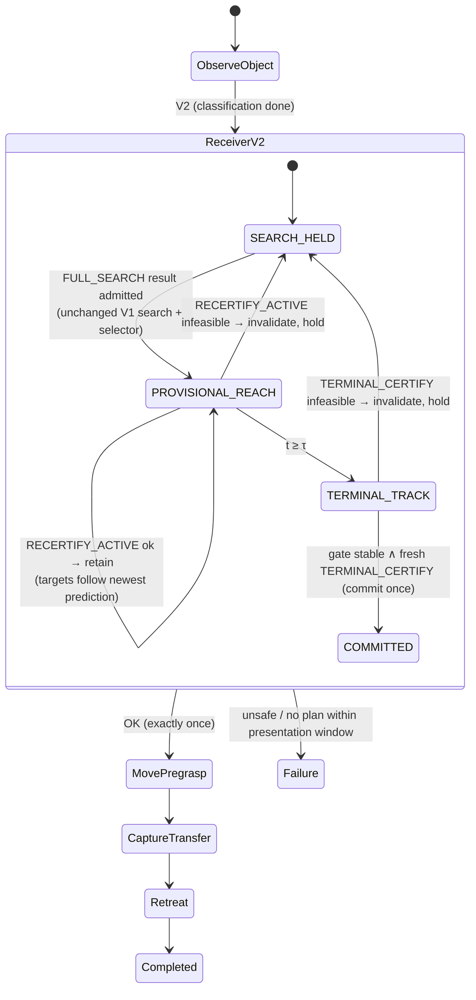

# TRIAD V2 — receding complete-action receiver control

Branch: `research/triad-v2-dynamic-control`. V1 baseline: `main @ 21d7022`.
The Phase A adversarial check is in [`PHASE_A_ADVERSARIAL_CHECK.md`](PHASE_A_ADVERSARIAL_CHECK.md);
evidence is in [`V2_EVIDENCE.md`](V2_EVIDENCE.md).

## 1. What changes, and what does not

| Held identical to V1 | Changed in V2 |
|---|---|
| Robot model, object geometry, scenario starts | **When** the global action may change: continuously before terminal commitment, never after |
| 14-lead temporal bank, 32 approach samples, 17 route generators | **Where** commitment happens: at the terminal standoff/capture boundary instead of before reach |
| Copied-state hard checks (IK, clearance, corridor, closure sweep, carried retreat, terminal timing audit) | The simulated giver is robot-independent (config `independent_scripted`, mandatory in V2) |
| Seven-term objective and weights; finite selector `selectFiniteEventPlan` | Prediction is an independent constant-twist extrapolation with no stop assumption |
| mc_rtc TransformTask/PostureTask QP; reach governor; terminal MovePregrasp, CaptureTransfer (centering, bilateral acquisition, virtual load transfer), Retreat | Certification of terminal capture is conditional on presentation at the predicted pose; the commit gate verifies that premise |

V1 stays runnable and bit-comparable: `receiverArchitecture: v1_frozen_prereach` and
`giverTruthModel: committed_plan` are the defaults. The V1 FrozenPlanSet hashes
of all four scenarios are unchanged (see evidence).

## 2. Architecture as implemented

**Provisional vs committed.** `ProvisionalReceiverPlanV2` (control-thread owned)
may drive the arm, may be retained with updated prediction-dependent targets or
replaced, and never authorizes gripper closure. `committedInterceptionPlan_` is
written by V2 only in `commitProvisionalReceiverPlanV2()`, behind a latch
(`v2CommitLatched_`, `v2CommitCount_`), which also locks global reselection.

**Worker jobs** (one in flight, latest-only):

| Job | From | Certifies |
|---|---|---|
| FULL_SEARCH | frozen snapshot of a **held** arm; bank poses from the independent prediction | the unchanged V1 finite search: all (τ, g, r) through carried retreat; the V1 selector picks the provisional plan at receipt time |
| RECERTIFY_ACTIVE | frozen snapshot of the **moving** arm | the active (τ, g, r) resumed at the current time index along the same reference, under the newest prediction, through terminal chain and carried retreat |
| TERMINAL_CERTIFY | frozen snapshot at the current object estimate | standoff → corridor insertion → capture dwell → closure/contact sweep → carried retreat → terminal timing audit |

**Generations.** Every job carries `planningGeneration` and the
`receiverStateGeneration` in force at submission. The state generation advances
on every adoption, retention update, invalidation, phase change and commitment. A
result is used only if both match and the plan id is unchanged; otherwise it is
logged `[V2StaleResultRejected] … canCommit=false canReplacePlan=false`.

**Persistence.** Retain while certified; replace only when infeasible or invalid;
no hysteresis parameter. Every retention, invalidation and replacement is logged
with its reason.

**Terminal commitment.** Gate, held for PresentationHold's `stableDwell`:

- t ≥ τ;
- mouth within PresentationHold `posTol`/`oriTol` of the current object-relative standoff;
- object estimate below the presentation rest thresholds;
- gripper open;
- fresh estimate;
- live clearance safe.

The commit additionally requires:

- a TERMINAL_CERTIFY snapshot taken while the gate held, with matching generations;
- object and mouth drift since that snapshot within the commit-freshness tolerances (15 mm, 0.12 rad; PresentationHold `posTol`/`oriTol`);
- the capture corridor and clearance safe *now*.

## 3. Worker snapshot

The planner worker reads only `planningSnapshot_` (frozen `q`, model copy,
mouth-to-base transform), `plannerConfig_` (configuration plus copied open-mouth
half-gap, joint position/velocity limits, object twist, estimate validity,
observation mode) and `v2Request_` (prediction record, active plan). Shared
planner functions select the snapshot through `plannerWorkerThreadActive()`, so
control-thread callers keep V1's live reads. `tools/check_worker_snapshot_purity.py`
enforces this over both translation units (it fails on untouched V1 source with
15 unguarded accesses).

## 4. Control-theoretic description

This is **not MPC**. No finite-horizon optimal control problem over inputs is
re-solved each sample; the incumbent is retained rather than re-optimised; there
is no terminal set or recursive-feasibility argument.

The accurate description is **an event-triggered receding-horizon supervisory
planner with plan certification and a single irreversible commitment transition
(a hybrid supervisor) over a task-space QP**:

- the candidate horizon recedes with the planning epoch;
- re-search is triggered by invalidation;
- the supervisor switches discrete plans and modes and generates references;
- the QP realizes them.

“Receding complete-action supervisory controller over a task-space QP” is
acceptable informally if “supervisory” is kept and “controller” is not read as
a closed-loop stability claim. “Maintaining feasibility” means re-certification,
not invariance.

## 5. Changes made after exploratory runs (disclosed)

The Phase A plan was implemented first. Exploratory V2 runs then exposed four
defects or conflations, each fixed without changing bank, weights, hard checks,
selector, terminal controller, capture, transfer or retreat. None of these
changes was tuned to a scenario.

1. **Geometry preparation.** V2 begin now calls `prepareCaptureSelection()` and
   refreshes the planner mirror. Without it the first safety check saw
   uncalibrated geometry and failed closed. The refresh is needed because V1's
   `calibrateMouthControlFrame()` refresh is unreachable after `return` (Phase A
   D8); V1 is left untouched.
2. **No-plan bound.** The plan reused `maximumEventSearchWallTime` (7 s) as a
   *total* no-plan budget. In V1 that constant is a *per-search compute* budget,
   and the run failed before the giver finished presenting. The bound is now
   “no certified plan while the object has been at rest longer than
   `presentationAcquisitionWindow` (7 s)”, which is V1's own post-stop
   acquisition semantics.
3. **Presented-at-rest prediction record.** Below the presentation rest
   thresholds (0.004 m/s, 0.08 rad/s) the V2 prediction reports zero twist,
   mirroring V1's static-observation convention.
4. **Exact memoization within one search (V2 only).** With the object at rest,
   the 14 hypotheses have bitwise-identical predicted poses and identical
   certification. Re-certifying them cost about 6.3 s, which exceeded the
   presentation window. The search now reuses the certification of an identical
   pose and recomputes only lead-dependent fields. This yields the same records
   and the same selector: a computational change, not a resolution change.

## 6. Known limitations

- **Bank latency.** A full search of the inherited bank takes 2.3–3.8 s while the
  object moves, and replacement requires holding the arm. Continuous motion is
  maintained only while the incumbent stays certified.
- **Capture scope.** Capture is quasi-static because the terminal controller is
  unchanged; interception with a still-moving handle at contact is out of scope.
- **Certification sensitivity.** Certification depends on the start state
  (local IK with redundancy). A grasp certified from one arm state can fail
  closure-centering certification from another (lateral-low).
- **Fallback safety.** Holding while the object moves is not a certified-safe
  fallback; the live clearance monitor remains fail-closed.
- **Simulation only.** Virtual load transfer; no hardware.
